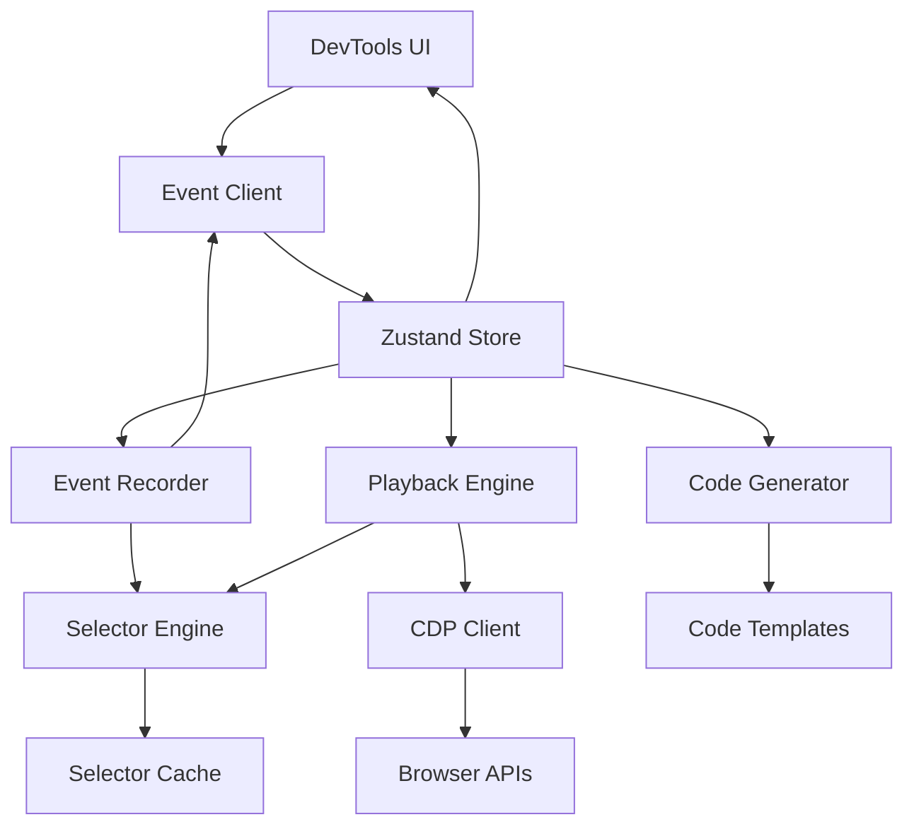
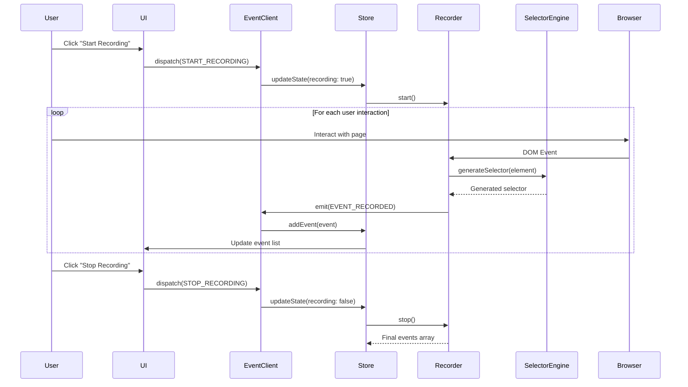
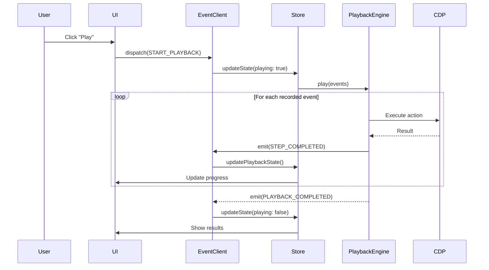
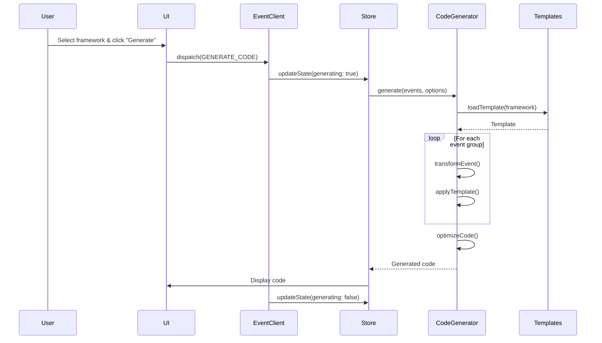

# Architecture Overview

This document provides a comprehensive overview of the Browser Automation Test Recorder Plugin architecture, design principles, and implementation details.

## Table of Contents

1. [Architecture Principles](#architecture-principles)
2. [System Overview](#system-overview)
3. [Core Components](#core-components)
4. [Data Flow](#data-flow)
5. [Event System](#event-system)
6. [State Management](#state-management)
7. [Extension Points](#extension-points)
8. [Performance Considerations](#performance-considerations)

## Architecture Principles

The Browser Automation Test Recorder Plugin follows these key architectural principles:

### 1. Modularity and Separation of Concerns

Each component has a single, well-defined responsibility:

```typescript
// Clear separation of concerns
interface ComponentResponsibilities {
  EventRecorder:     "Capture and process DOM events";
  SelectorEngine:    "Generate reliable element selectors";
  PlaybackEngine:    "Execute recorded events";
  CodeGenerator:     "Convert events to test code";
  DevToolsClient:    "Communicate with DevTools panel";
  Store:             "Manage application state";
}
```

### 2. Event-Driven Architecture

All components communicate through a centralized event system:

```typescript
// Event-driven communication
eventClient.emit('recording-started', { sessionId, timestamp });
eventClient.on('event-recorded', (event) => store.addEvent(event));
eventClient.on('playback-requested', (events) => playbackEngine.play(events));
```

### 3. Extensibility

Plugin supports custom extensions and integrations:

```typescript
// Extensible generator system
interface CodeGeneratorFactory {
  createGenerator(framework: string): CodeGenerator;
  registerTemplate(name: string, template: CodeTemplate): void;
  addCustomStrategy(strategy: GenerationStrategy): void;
}
```

### 4. Type Safety

Comprehensive TypeScript typing throughout:

```typescript
// Strong typing for all interfaces
interface RecordedEvent {
  id: string;
  type: EventType;
  timestamp: number;
  target: EventTarget;
  data: EventData;
  context: EventContext;
  metadata: EventMetadata;
}
```

### 5. Performance First

Optimized for high-performance recording and playback:

```typescript
// Performance optimizations
interface PerformanceFeatures {
  eventBuffering:     "Batch process events";
  selectorCaching:    "Cache generated selectors";
  lazyLoading:       "Load components on demand";
  memoryManagement:  "Automatic cleanup and GC";
}
```

## System Overview

### High-Level Architecture

```
┌─────────────────────────────────────────────────────────────┐
│                    Browser Environment                        │
├─────────────────────────────────────────────────────────────┤
│                                                             │
│  ┌─────────────────┐    ┌─────────────────┐               │
│  │   Web Page      │    │   DevTools      │               │
│  │                 │    │    Panel        │               │
│  │  ┌───────────┐  │    │  ┌───────────┐  │               │
│  │  │    DOM    │  │◄──►│  │    UI     │  │               │
│  │  └───────────┘  │    │  └───────────┘  │               │
│  │                 │    │                 │               │
│  └─────────────────┘    └─────────────────┘               │
│           │                       │                        │
│           ▼                       ▼                        │
│  ┌─────────────────────────────────────────────────────┐   │
│  │              Plugin Core                            │   │
│  │                                                     │   │
│  │  ┌─────────────┐  ┌─────────────┐  ┌─────────────┐  │   │
│  │  │   Event     │  │  Selector   │  │  Playback   │  │   │
│  │  │  Recorder   │  │   Engine    │  │   Engine    │  │   │
│  │  └─────────────┘  └─────────────┘  └─────────────┘  │   │
│  │                                                     │   │
│  │  ┌─────────────┐  ┌─────────────┐  ┌─────────────┐  │   │
│  │  │    Code     │  │   Store     │  │   Event     │  │   │
│  │  │  Generator  │  │             │  │   Client    │  │   │
│  │  └─────────────┘  └─────────────┘  └─────────────┘  │   │
│  └─────────────────────────────────────────────────────┘   │
│                                                             │
└─────────────────────────────────────────────────────────────┘
```

### Component Interactions



## Core Components

### 1. Event Recorder

**Responsibility**: Capture and process browser events

**Key Features**:
- DOM event interception
- Intelligent event filtering
- Real-time event processing
- Screenshot and context capture

**Architecture**:
```typescript
class EventRecorder {
  private selectorEngine: SelectorEngine;
  private eventClient: BrowserAutomationEventClient;
  private eventBuffer: RecordedEvent[] = [];
  private eventProcessors: EventProcessor[] = [];
  private isRecording = false;
  
  // Core methods
  async start(options: RecordingOptions): Promise<string>;
  async stop(): Promise<RecordedEvent[]>;
  private async processEvent(event: Event): Promise<RecordedEvent>;
  private shouldIgnoreEvent(event: Event): boolean;
}
```

**Event Processing Pipeline**:
```
Raw DOM Event → Filter → Process → Generate Selector → Add Context → Buffer → Emit
```

### 2. Selector Engine

**Responsibility**: Generate reliable, maintainable element selectors

**Key Features**:
- Multiple selector strategies
- Automatic selector healing
- Confidence scoring
- Fallback generation

**Architecture**:
```typescript
class SelectorEngine {
  private strategies: SelectorStrategy[] = [];
  private healingStrategies: HealingStrategy[] = [];
  private cache: Map<Element, GeneratedSelector> = new Map();
  
  async generateSelector(element: Element): Promise<GeneratedSelector>;
  async healSelector(selector: string): Promise<HealingResult>;
  async validateSelector(selector: string): Promise<ValidationResult>;
}
```

**Selector Generation Process**:
```
Element → Analyze → Apply Strategies → Score → Generate Fallbacks → Cache → Return
```

### 3. Playback Engine

**Responsibility**: Execute recorded events with debugging capabilities

**Key Features**:
- Variable speed playback
- Step-by-step debugging
- Error recovery
- Visual comparison

**Architecture**:
```typescript
class PlaybackEngine {
  private cdpClient: CDPClient;
  private selectorResolver: SelectorResolver;
  private monitor: PlaybackMonitor;
  private errorRecovery: ErrorRecoveryManager;
  
  async play(events: RecordedEvent[]): Promise<PlaybackResult>;
  async executeStep(event: RecordedEvent): Promise<StepResult>;
  private async resolveSelector(selector: string): Promise<Element>;
}
```

**Playback Execution Flow**:
```
Events → Validate → Resolve Selectors → Execute → Monitor → Handle Errors → Report
```

### 4. Code Generator

**Responsibility**: Convert recorded events to framework-specific test code

**Key Features**:
- Multiple framework support
- Template-based generation
- Custom code templates
- Optimization passes

**Architecture**:
```typescript
abstract class BaseGenerator implements CodeGenerator {
  protected template: CodeTemplate;
  protected optimizers: CodeOptimizer[] = [];
  
  abstract generate(events: RecordedEvent[]): Promise<string>;
  protected generateTestMethod(events: RecordedEvent[]): string;
  protected optimizeCode(code: string): string;
}

class PlaywrightGenerator extends BaseGenerator {
  // Playwright-specific implementation
}
```

**Code Generation Pipeline**:
```
Events → Group → Transform → Apply Template → Optimize → Format → Output
```

### 5. DevTools Integration

**Responsibility**: Integrate with TanStack DevTools ecosystem

**Key Features**:
- Event client integration
- Real-time communication
- State synchronization
- Panel rendering

**Architecture**:
```typescript
class BrowserAutomationEventClient extends DevToolsEventClient {
  private store: BrowserAutomationStore;
  private subscribers = new Set<() => void>();
  
  subscribe(callback: () => void): () => void;
  dispatch(action: BrowserAutomationAction): void;
  getState(): BrowserAutomationState;
}
```

## Data Flow

### Recording Flow



### Playback Flow



### Code Generation Flow



## Event System

### Event Types

The plugin uses a comprehensive event system for component communication:

```typescript
// Core events
type BrowserAutomationEvent = 
  // Recording events
  | { type: 'RECORDING_STARTED'; payload: { sessionId: string; options: RecordingOptions } }
  | { type: 'RECORDING_STOPPED'; payload: { events: RecordedEvent[] } }
  | { type: 'EVENT_RECORDED'; payload: { event: RecordedEvent } }
  | { type: 'RECORDING_PAUSED'; payload: {} }
  | { type: 'RECORDING_RESUMED'; payload: {} }
  
  // Playback events
  | { type: 'PLAYBACK_STARTED'; payload: { events: RecordedEvent[] } }
  | { type: 'PLAYBACK_STOPPED'; payload: { result: PlaybackResult } }
  | { type: 'STEP_EXECUTED'; payload: { step: number; event: RecordedEvent } }
  | { type: 'PLAYBACK_ERROR'; payload: { error: PlaybackError } }
  
  // Code generation events
  | { type: 'CODE_GENERATED'; payload: { framework: string; code: string } }
  | { type: 'TEMPLATE_CHANGED'; payload: { template: string } }
  
  // UI events
  | { type: 'TAB_CHANGED'; payload: { tab: DevToolsTab } }
  | { type: 'SETTINGS_UPDATED'; payload: { settings: Partial<PluginSettings> } }
  
  // Collaboration events
  | { type: 'RECORDING_SHARED'; payload: { shareUrl: string } }
  | { type: 'COMMENT_ADDED'; payload: { comment: Comment } };
```

### Event Client Implementation

```typescript
class BrowserAutomationEventClient extends EventEmitter {
  private store: BrowserAutomationStore;
  
  constructor(store: BrowserAutomationStore) {
    super();
    this.store = store;
  }
  
  // DevTools integration
  subscribe = (callback: () => void): (() => void) => {
    const unsubscribe = this.store.subscribe(callback);
    return unsubscribe;
  };
  
  getState = (): BrowserAutomationState => {
    return this.store.getState();
  };
  
  // Event dispatching
  dispatch = (action: BrowserAutomationAction): void => {
    // Update store
    this.store.dispatch(action);
    
    // Emit event for other components
    this.emit(action.type, action.payload);
  };
  
  // Convenience methods
  startRecording = (options: RecordingOptions): void => {
    this.dispatch({ type: 'RECORDING_STARTED', payload: { sessionId: generateId(), options } });
  };
  
  stopRecording = (events: RecordedEvent[]): void => {
    this.dispatch({ type: 'RECORDING_STOPPED', payload: { events } });
  };
  
  recordEvent = (event: RecordedEvent): void => {
    this.dispatch({ type: 'EVENT_RECORDED', payload: { event } });
  };
}
```

## State Management

### Store Architecture

The plugin uses Zustand for state management with a modular store structure:

```typescript
interface BrowserAutomationState {
  // Recording state
  recording: RecordingState;
  
  // Playback state  
  playback: PlaybackState;
  
  // Code generation state
  codeGeneration: CodeGenerationState;
  
  // UI state
  ui: UIState;
  
  // Settings
  settings: PluginSettings;
  
  // Collaboration
  collaboration: CollaborationState;
}

// Modular store slices
const createRecordingSlice: StateCreator<BrowserAutomationState, [], [], RecordingSlice> = (set, get) => ({
  recording: {
    isRecording: false,
    isPaused: false,
    sessionId: null,
    events: [],
    options: defaultRecordingOptions
  },
  
  startRecording: (options) => set(state => ({
    recording: {
      ...state.recording,
      isRecording: true,
      sessionId: generateId(),
      options: { ...state.recording.options, ...options },
      events: []
    }
  })),
  
  stopRecording: () => set(state => ({
    recording: {
      ...state.recording,
      isRecording: false,
      sessionId: null
    }
  })),
  
  addEvent: (event) => set(state => ({
    recording: {
      ...state.recording,
      events: [...state.recording.events, event]
    }
  }))
});
```

### State Persistence

Critical state is persisted across browser sessions:

```typescript
// Persistence configuration
const persistConfig = {
  name: 'browser-automation-storage',
  storage: createJSONStorage(() => localStorage),
  partialize: (state: BrowserAutomationState) => ({
    settings: state.settings,
    recordings: state.recording.events.length > 0 ? [state.recording] : [],
    codeTemplates: state.codeGeneration.customTemplates
  })
};

// Create persisted store
export const useBrowserAutomationStore = create<BrowserAutomationState>()(
  persist(
    subscribeWithSelector(
      immer((...args) => ({
        ...createRecordingSlice(...args),
        ...createPlaybackSlice(...args),
        ...createCodeGenerationSlice(...args),
        ...createUISlice(...args),
        ...createCollaborationSlice(...args)
      }))
    ),
    persistConfig
  )
);
```

## Extension Points

### 1. Custom Code Generators

Add support for new testing frameworks:

```typescript
// Register custom generator
interface CustomGeneratorRegistration {
  framework: string;
  generator: CodeGenerator;
  templates: CodeTemplate[];
  defaultOptions: GenerationOptions;
}

class CodeGeneratorRegistry {
  private generators = new Map<string, CodeGenerator>();
  
  register(registration: CustomGeneratorRegistration): void {
    this.generators.set(registration.framework, registration.generator);
    
    // Register templates
    registration.templates.forEach(template => {
      this.registerTemplate(registration.framework, template);
    });
  }
  
  create(framework: string): CodeGenerator | null {
    return this.generators.get(framework) || null;
  }
}

// Usage
const customGenerator = new CustomGenerator();
registry.register({
  framework: 'webdriver-io',
  generator: customGenerator,
  templates: [webdriverIOTemplate],
  defaultOptions: { typescript: true }
});
```

### 2. Custom Selector Strategies

Add custom selector generation strategies:

```typescript
interface SelectorStrategy {
  name: string;
  priority: number;
  canGenerate(element: Element): boolean;
  generate(element: Element): Promise<string | null>;
  validate(selector: string, element: Element): Promise<boolean>;
}

class CustomDataAttributeStrategy implements SelectorStrategy {
  name = 'custom-data-attribute';
  priority = 100; // High priority
  
  canGenerate(element: Element): boolean {
    return element.hasAttribute('data-custom-id');
  }
  
  async generate(element: Element): Promise<string | null> {
    const customId = element.getAttribute('data-custom-id');
    return customId ? `[data-custom-id="${customId}"]` : null;
  }
  
  async validate(selector: string, element: Element): Promise<boolean> {
    const found = document.querySelector(selector);
    return found === element;
  }
}

// Register strategy
selectorEngine.addStrategy(new CustomDataAttributeStrategy());
```

### 3. Custom Event Processors

Add custom event processing logic:

```typescript
interface EventProcessor {
  name: string;
  priority: number;
  canProcess(event: Event, element: Element): boolean;
  process(event: Event, element: Element): Promise<Partial<RecordedEvent>>;
}

class FormSubmissionProcessor implements EventProcessor {
  name = 'form-submission';
  priority = 50;
  
  canProcess(event: Event, element: Element): boolean {
    return event.type === 'submit' && element.tagName === 'FORM';
  }
  
  async process(event: Event, element: Element): Promise<Partial<RecordedEvent>> {
    const form = element as HTMLFormElement;
    const formData = new FormData(form);
    
    return {
      type: 'submit',
      data: {
        action: form.action,
        method: form.method,
        formData: Object.fromEntries(formData.entries())
      },
      metadata: {
        validationState: this.getValidationState(form)
      }
    };
  }
  
  private getValidationState(form: HTMLFormElement): ValidationState {
    // Custom validation logic
    return {
      isValid: form.checkValidity(),
      invalidFields: Array.from(form.elements)
        .filter(element => !element.validity.valid)
        .map(element => element.name)
    };
  }
}

// Register processor
eventRecorder.addProcessor(new FormSubmissionProcessor());
```

### 4. Plugin Extensions

Create extensions that integrate with the plugin:

```typescript
interface PluginExtension {
  name: string;
  version: string;
  initialize(context: PluginContext): void;
  dispose(): void;
}

interface PluginContext {
  eventClient: BrowserAutomationEventClient;
  store: BrowserAutomationStore;
  registerComponent(name: string, component: React.ComponentType): void;
  registerTab(tab: CustomTab): void;
  registerCommand(command: Command): void;
}

class AnalyticsExtension implements PluginExtension {
  name = 'analytics-extension';
  version = '1.0.0';
  
  initialize(context: PluginContext): void {
    // Listen to events and send analytics
    context.eventClient.on('EVENT_RECORDED', (event) => {
      this.sendAnalytics('event_recorded', {
        type: event.type,
        timestamp: event.timestamp
      });
    });
    
    // Register analytics tab
    context.registerTab({
      id: 'analytics',
      label: 'Analytics',
      icon: BarChart,
      component: AnalyticsPanel
    });
  }
  
  dispose(): void {
    // Cleanup
  }
  
  private sendAnalytics(event: string, data: any): void {
    // Send to analytics service
  }
}

// Register extension
pluginManager.register(new AnalyticsExtension());
```

## Performance Considerations

### 1. Event Processing Optimization

```typescript
class OptimizedEventRecorder extends EventRecorder {
  private eventQueue: Event[] = [];
  private processingBatch = false;
  private batchSize = 10;
  private batchTimeout = 100; // ms
  
  protected async handleDOMEvent(event: Event): Promise<void> {
    // Add to queue instead of processing immediately
    this.eventQueue.push(event);
    
    // Process batch if queue is full or after timeout
    if (this.eventQueue.length >= this.batchSize) {
      await this.processBatch();
    } else if (!this.processingBatch) {
      setTimeout(() => this.processBatch(), this.batchTimeout);
    }
  }
  
  private async processBatch(): Promise<void> {
    if (this.processingBatch || this.eventQueue.length === 0) return;
    
    this.processingBatch = true;
    const batch = this.eventQueue.splice(0, this.batchSize);
    
    // Process events in parallel where possible
    const processedEvents = await Promise.all(
      batch.map(event => this.processEvent(event))
    );
    
    // Emit batch of events
    this.eventClient.emit('EVENTS_RECORDED', { events: processedEvents });
    
    this.processingBatch = false;
    
    // Process remaining queue
    if (this.eventQueue.length > 0) {
      setTimeout(() => this.processBatch(), 0);
    }
  }
}
```

### 2. Memory Management

```typescript
class MemoryManager {
  private static readonly MAX_EVENTS = 10000;
  private static readonly CLEANUP_THRESHOLD = 8000;
  
  static manageEventBuffer(events: RecordedEvent[]): RecordedEvent[] {
    if (events.length > this.MAX_EVENTS) {
      console.warn('Event buffer limit reached, cleaning up old events');
      
      // Keep most recent events and important events
      const recentEvents = events.slice(-this.CLEANUP_THRESHOLD);
      const importantEvents = events
        .slice(0, -this.CLEANUP_THRESHOLD)
        .filter(event => this.isImportantEvent(event));
      
      return [...importantEvents, ...recentEvents];
    }
    
    return events;
  }
  
  private static isImportantEvent(event: RecordedEvent): boolean {
    const importantTypes: EventType[] = ['navigation', 'submit', 'assertion'];
    return importantTypes.includes(event.type);
  }
  
  static cleanup(): void {
    // Force garbage collection of caches
    selectorEngine.clearCache();
    playbackEngine.clearScreenshots();
    
    // Clear temporary data
    if ('gc' in global) {
      (global as any).gc();
    }
  }
}
```

### 3. Lazy Loading

```typescript
// Lazy load heavy components
const PlaybackTab = lazy(() => import('./tabs/PlaybackTab'));
const TestGeneratorTab = lazy(() => import('./tabs/TestGeneratorTab'));
const AdvancedFeaturesTab = lazy(() => import('./tabs/AdvancedFeaturesTab'));

// Code splitting for generators
const loadGenerator = async (framework: string): Promise<CodeGenerator> => {
  switch (framework) {
    case 'playwright':
      const { PlaywrightGenerator } = await import('./generators/playwright-generator');
      return new PlaywrightGenerator();
    
    case 'cypress':
      const { CypressGenerator } = await import('./generators/cypress-generator');
      return new CypressGenerator();
    
    default:
      throw new Error(`Unknown framework: ${framework}`);
  }
};
```

### 4. Performance Monitoring

```typescript
class PerformanceMonitor {
  private metrics = new Map<string, PerformanceMetric>();
  
  startOperation(name: string): PerformanceMeasurement {
    const start = performance.now();
    
    return {
      end: () => {
        const duration = performance.now() - start;
        this.recordMetric(name, duration);
      }
    };
  }
  
  private recordMetric(name: string, duration: number): void {
    const metric = this.metrics.get(name) || {
      count: 0,
      totalDuration: 0,
      maxDuration: 0,
      minDuration: Infinity
    };
    
    metric.count++;
    metric.totalDuration += duration;
    metric.maxDuration = Math.max(metric.maxDuration, duration);
    metric.minDuration = Math.min(metric.minDuration, duration);
    
    this.metrics.set(name, metric);
  }
  
  getMetrics(): Record<string, PerformanceMetric> {
    return Object.fromEntries(this.metrics.entries());
  }
}

// Usage throughout the codebase
const perf = performanceMonitor.startOperation('selector-generation');
const selector = await selectorEngine.generateSelector(element);
perf.end();
```

## Conclusion

The Browser Automation Test Recorder Plugin architecture emphasizes:

- **Modularity**: Clear separation of concerns with well-defined interfaces
- **Extensibility**: Multiple extension points for customization
- **Performance**: Optimized for high-throughput recording and playback
- **Type Safety**: Comprehensive TypeScript typing for reliability
- **Maintainability**: Clean code architecture with comprehensive testing

This architecture supports the plugin's core goals of providing reliable, maintainable browser automation test recording while remaining flexible enough to adapt to different testing needs and environments.

---

*For implementation details of specific components, see the [API Documentation](../api/README.md) and [Component Guides](./components/README.md).*