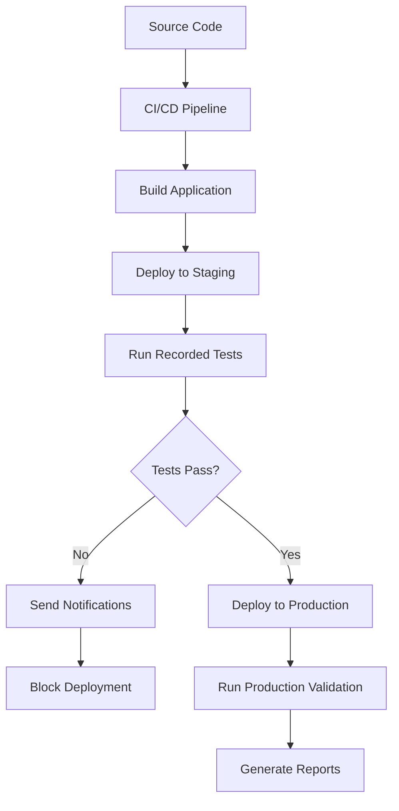

# CI/CD Integration Guide

Integrate the Browser Automation Test Recorder Plugin into your continuous integration and deployment pipelines for automated testing, quality assurance, and deployment validation.

## Table of Contents

1. [Overview](#overview)
2. [GitHub Actions](#github-actions)
3. [Jenkins](#jenkins)
4. [GitLab CI](#gitlab-ci)
5. [Azure DevOps](#azure-devops)
6. [Docker Integration](#docker-integration)
7. [Test Report Integration](#test-report-integration)
8. [Environment Management](#environment-management)
9. [Best Practices](#best-practices)

## Overview

The Browser Automation Test Recorder Plugin can be integrated into various CI/CD systems to:

- **Run Generated Tests**: Execute tests created from recordings
- **Validate Deployments**: Test critical user flows after deployment
- **Cross-browser Testing**: Run tests across multiple browsers
- **Visual Regression**: Compare screenshots against baselines
- **Performance Monitoring**: Track performance metrics over time
- **Test Generation**: Create tests from production user flows

### Integration Architecture



## GitHub Actions

### Basic Workflow

Create `.github/workflows/browser-automation-tests.yml`:

```yaml
name: Browser Automation Tests

on:
  push:
    branches: [ main, develop ]
  pull_request:
    branches: [ main ]

jobs:
  test:
    runs-on: ubuntu-latest
    
    strategy:
      matrix:
        browser: [chromium, firefox, webkit]
        node-version: [18, 20]
    
    steps:
    - name: Checkout code
      uses: actions/checkout@v4
    
    - name: Setup Node.js
      uses: actions/setup-node@v4
      with:
        node-version: ${{ matrix.node-version }}
        cache: 'npm'
    
    - name: Install dependencies
      run: npm ci
    
    - name: Install Playwright browsers
      run: npx playwright install --with-deps ${{ matrix.browser }}
    
    - name: Build application
      run: npm run build
    
    - name: Start application
      run: |
        npm run start:test &
        npx wait-on http://localhost:3000
    
    - name: Run browser automation tests
      run: npm run test:browser-automation
      env:
        BROWSER: ${{ matrix.browser }}
        CI: true
    
    - name: Upload test results
      uses: actions/upload-artifact@v4
      if: always()
      with:
        name: test-results-${{ matrix.browser }}-${{ matrix.node-version }}
        path: |
          test-results/
          playwright-report/
        retention-days: 30
    
    - name: Upload screenshots
      uses: actions/upload-artifact@v4
      if: failure()
      with:
        name: screenshots-${{ matrix.browser }}-${{ matrix.node-version }}
        path: test-results/screenshots/
        retention-days: 30
```

### Advanced Workflow with Test Generation

```yaml
name: Advanced Browser Automation

on:
  schedule:
    # Run weekly to update test recordings from production
    - cron: '0 2 * * 1'
  workflow_dispatch:
    inputs:
      environment:
        description: 'Environment to test'
        required: true
        default: 'staging'
        type: choice
        options:
        - staging
        - production

jobs:
  record-and-test:
    runs-on: ubuntu-latest
    
    steps:
    - uses: actions/checkout@v4
    
    - name: Setup Node.js
      uses: actions/setup-node@v4
      with:
        node-version: '20'
        cache: 'npm'
    
    - name: Install dependencies
      run: |
        npm ci
        npx playwright install --with-deps
    
    - name: Record new user flows
      if: github.event_name == 'schedule'
      run: |
        npm run record-flows -- --environment production --output recordings/
      env:
        RECORD_MODE: true
        BASE_URL: https://production.example.com
    
    - name: Generate tests from recordings
      if: github.event_name == 'schedule'
      run: |
        npm run generate-tests -- --input recordings/ --output tests/generated/
    
    - name: Run existing tests
      run: |
        npm run test:browser-automation -- --reporter=github
      env:
        BASE_URL: ${{ github.event.inputs.environment == 'production' && 'https://production.example.com' || 'https://staging.example.com' }}
    
    - name: Update test baselines
      if: github.event_name == 'schedule'
      run: |
        git config --local user.email "action@github.com"
        git config --local user.name "GitHub Action"
        git add recordings/ tests/generated/
        git diff --staged --quiet || git commit -m "chore: update test recordings and generated tests"
        git push
    
    - name: Notify on failure
      if: failure()
      uses: 8398a7/action-slack@v3
      with:
        status: failure
        channel: '#qa-alerts'
        text: 'Browser automation tests failed in ${{ github.event.inputs.environment || "production" }}'
      env:
        SLACK_WEBHOOK_URL: ${{ secrets.SLACK_WEBHOOK_URL }}
```

### Visual Regression Testing

```yaml
name: Visual Regression Tests

on:
  pull_request:
    paths:
      - 'src/**'
      - 'public/**'

jobs:
  visual-tests:
    runs-on: ubuntu-latest
    
    steps:
    - uses: actions/checkout@v4
      with:
        fetch-depth: 0
    
    - name: Setup Node.js
      uses: actions/setup-node@v4
      with:
        node-version: '20'
        cache: 'npm'
    
    - name: Install dependencies
      run: |
        npm ci
        npx playwright install --with-deps chromium
    
    - name: Build current version
      run: npm run build
    
    - name: Run visual regression tests
      run: npm run test:visual-regression
    
    - name: Upload visual diff report
      uses: actions/upload-artifact@v4
      if: failure()
      with:
        name: visual-regression-report
        path: visual-regression-report/
    
    - name: Comment PR with visual changes
      uses: actions/github-script@v7
      if: failure()
      with:
        script: |
          const fs = require('fs');
          if (fs.existsSync('visual-regression-report/summary.json')) {
            const summary = JSON.parse(fs.readFileSync('visual-regression-report/summary.json', 'utf8'));
            const body = `## Visual Regression Detected 📸
            
            Found ${summary.failures} visual differences:
            ${summary.failures.map(f => `- ${f.test}: ${f.difference}% different`).join('\n')}
            
            [View detailed report](https://github.com/${{ github.repository }}/actions/runs/${{ github.run_id }})`;
            
            github.rest.issues.createComment({
              issue_number: context.issue.number,
              owner: context.repo.owner,
              repo: context.repo.repo,
              body: body
            });
          }
```

## Jenkins

### Jenkinsfile Configuration

```groovy
pipeline {
    agent any
    
    parameters {
        choice(
            name: 'BROWSER',
            choices: ['chromium', 'firefox', 'webkit'],
            description: 'Browser to run tests against'
        )
        booleanParam(
            name: 'RECORD_NEW_FLOWS',
            defaultValue: false,
            description: 'Record new user flows from production'
        )
    }
    
    environment {
        NODE_VERSION = '20'
        CI = 'true'
    }
    
    stages {
        stage('Setup') {
            steps {
                script {
                    // Install Node.js
                    sh '''
                        curl -fsSL https://deb.nodesource.com/setup_${NODE_VERSION}.x | sudo -E bash -
                        sudo apt-get install -y nodejs
                    '''
                }
                
                // Install dependencies
                sh 'npm ci'
                sh 'npx playwright install --with-deps'
            }
        }
        
        stage('Build') {
            steps {
                sh 'npm run build'
            }
        }
        
        stage('Start Application') {
            steps {
                script {
                    sh 'npm run start:test &'
                    sh 'npx wait-on http://localhost:3000 --timeout 60000'
                }
            }
        }
        
        stage('Record Flows') {
            when {
                params.RECORD_NEW_FLOWS
            }
            steps {
                withCredentials([
                    string(credentialsId: 'production-url', variable: 'PRODUCTION_URL'),
                    usernamePassword(credentialsId: 'test-user', usernameVariable: 'TEST_USERNAME', passwordVariable: 'TEST_PASSWORD')
                ]) {
                    sh '''
                        npm run record-flows -- \
                            --environment production \
                            --base-url ${PRODUCTION_URL} \
                            --username ${TEST_USERNAME} \
                            --password ${TEST_PASSWORD} \
                            --output recordings/
                    '''
                }
            }
        }
        
        stage('Generate Tests') {
            when {
                params.RECORD_NEW_FLOWS
            }
            steps {
                sh 'npm run generate-tests -- --input recordings/ --output tests/generated/'
            }
        }
        
        stage('Run Tests') {
            parallel {
                stage('Unit Tests') {
                    steps {
                        sh 'npm run test:unit'
                    }
                }
                
                stage('Browser Automation Tests') {
                    steps {
                        sh "npm run test:browser-automation -- --browser=${params.BROWSER}"
                    }
                }
                
                stage('Visual Regression Tests') {
                    steps {
                        sh 'npm run test:visual-regression'
                    }
                }
            }
        }
        
        stage('Performance Tests') {
            steps {
                sh '''
                    npm run test:performance -- \
                        --browser=${BROWSER} \
                        --output performance-results.json
                '''
            }
        }
    }
    
    post {
        always {
            // Archive test results
            archiveArtifacts artifacts: 'test-results/**/*', fingerprint: true
            archiveArtifacts artifacts: 'playwright-report/**/*', fingerprint: true
            
            // Publish test results
            publishTestResults testResultsPattern: 'test-results/junit.xml'
            
            // Publish performance results
            script {
                if (fileExists('performance-results.json')) {
                    publishHTML([
                        allowMissing: false,
                        alwaysLinkToLastBuild: true,
                        keepAll: true,
                        reportDir: 'performance-report',
                        reportFiles: 'index.html',
                        reportName: 'Performance Report'
                    ])
                }
            }
        }
        
        failure {
            // Archive screenshots on failure
            archiveArtifacts artifacts: 'test-results/screenshots/**/*', fingerprint: true
            
            // Send notifications
            emailext (
                subject: "Browser Automation Tests Failed - ${env.JOB_NAME} #${env.BUILD_NUMBER}",
                body: "The browser automation tests have failed. Please check the build logs and screenshots.",
                to: "${env.CHANGE_AUTHOR_EMAIL}"
            )
        }
        
        success {
            script {
                if (params.RECORD_NEW_FLOWS) {
                    // Commit new recordings and generated tests
                    sh '''
                        git config user.name "Jenkins"
                        git config user.email "jenkins@company.com"
                        git add recordings/ tests/generated/
                        git commit -m "chore: update test recordings and generated tests [skip ci]" || true
                        git push origin ${env.BRANCH_NAME} || true
                    '''
                }
            }
        }
    }
}
```

### Jenkins Pipeline Script (Scripted)

```groovy
node {
    try {
        stage('Checkout') {
            checkout scm
        }
        
        stage('Setup Environment') {
            sh '''
                # Install Node.js via NodeJS plugin or manually
                . ~/.nvm/nvm.sh
                nvm use 20
                npm ci
                npx playwright install --with-deps
            '''
        }
        
        stage('Build and Test') {
            parallel(
                'Build Application': {
                    sh 'npm run build'
                },
                'Run Unit Tests': {
                    sh 'npm run test:unit'
                }
            )
        }
        
        stage('Browser Automation Tests') {
            def browsers = ['chromium', 'firefox', 'webkit']
            def parallelTests = [:]
            
            browsers.each { browser ->
                parallelTests[browser] = {
                    sh """
                        npm run start:test &
                        npx wait-on http://localhost:3000
                        npm run test:browser-automation -- --browser=${browser}
                    """
                }
            }
            
            parallel parallelTests
        }
        
        stage('Deploy and Validate') {
            when {
                branch 'main'
            }
            sh '''
                # Deploy to staging
                npm run deploy:staging
                
                # Run validation tests against staging
                npm run test:validation -- --base-url https://staging.example.com
            '''
        }
        
    } catch (Exception e) {
        currentBuild.result = 'FAILURE'
        
        // Archive artifacts on failure
        archiveArtifacts artifacts: 'test-results/**/*', allowEmptyArchive: true
        
        // Send notifications
        emailext (
            subject: "Build Failed: ${env.JOB_NAME} - ${env.BUILD_NUMBER}",
            body: "Build failed with error: ${e.getMessage()}",
            to: env.CHANGE_AUTHOR_EMAIL
        )
        
        throw e
    } finally {
        // Cleanup
        sh 'pkill -f "npm run start:test" || true'
    }
}
```

## GitLab CI

### `.gitlab-ci.yml` Configuration

```yaml
stages:
  - build
  - test
  - deploy
  - validate

variables:
  NODE_VERSION: "20"
  CI: "true"

# Cache configuration
cache:
  key: ${CI_COMMIT_REF_SLUG}
  paths:
    - node_modules/
    - ~/.cache/ms-playwright/

# Base job template
.node_template: &node_template
  image: node:${NODE_VERSION}
  before_script:
    - npm ci
    - npx playwright install --with-deps

build:
  <<: *node_template
  stage: build
  script:
    - npm run build
  artifacts:
    paths:
      - dist/
    expire_in: 1 hour

# Unit tests
test:unit:
  <<: *node_template
  stage: test
  script:
    - npm run test:unit
  coverage: '/All files[^|]*\|[^|]*\s+([\d\.]+)/'
  artifacts:
    reports:
      coverage_report:
        coverage_format: cobertura
        path: coverage/cobertura-coverage.xml
      junit: test-results/junit.xml

# Browser automation tests
test:browser-automation:
  <<: *node_template
  stage: test
  parallel:
    matrix:
      - BROWSER: [chromium, firefox, webkit]
  script:
    - npm run start:test &
    - npx wait-on http://localhost:3000 --timeout 60000
    - npm run test:browser-automation -- --browser=$BROWSER
  artifacts:
    when: always
    paths:
      - test-results/
      - playwright-report/
    reports:
      junit: test-results/junit-$BROWSER.xml
    expire_in: 1 week

# Visual regression tests
test:visual-regression:
  <<: *node_template
  stage: test
  script:
    - npm run build
    - npm run start:test &
    - npx wait-on http://localhost:3000 --timeout 60000
    - npm run test:visual-regression
  artifacts:
    when: on_failure
    paths:
      - visual-regression-report/
    expire_in: 1 week
  allow_failure: true

# Deploy to staging
deploy:staging:
  stage: deploy
  script:
    - npm run deploy:staging
  environment:
    name: staging
    url: https://staging.example.com
  only:
    - develop

# Deploy to production
deploy:production:
  stage: deploy
  script:
    - npm run deploy:production
  environment:
    name: production
    url: https://example.com
  only:
    - main
  when: manual

# Validate deployment
validate:staging:
  <<: *node_template
  stage: validate
  dependencies:
    - deploy:staging
  script:
    - npm run test:validation -- --base-url https://staging.example.com
  environment:
    name: staging
    action: verify
  only:
    - develop

validate:production:
  <<: *node_template
  stage: validate
  dependencies:
    - deploy:production
  script:
    - npm run test:validation -- --base-url https://example.com
  environment:
    name: production
    action: verify
  only:
    - main

# Scheduled job to record new flows
record:flows:
  <<: *node_template
  stage: test
  script:
    - |
      npm run record-flows -- \
        --environment production \
        --base-url https://example.com \
        --output recordings/
    - npm run generate-tests -- --input recordings/ --output tests/generated/
    - |
      if [ -n "$(git status --porcelain)" ]; then
        git config --local user.email "gitlab-ci@example.com"
        git config --local user.name "GitLab CI"
        git add recordings/ tests/generated/
        git commit -m "chore: update test recordings and generated tests [skip ci]"
        git push https://oauth2:${CI_PUSH_TOKEN}@${CI_SERVER_HOST}/${CI_PROJECT_PATH}.git HEAD:${CI_COMMIT_REF_NAME}
      fi
  variables:
    CI_PUSH_TOKEN: $CI_PUSH_TOKEN
  only:
    - schedules
```

### GitLab CI with Docker

```yaml
# Use custom Docker image with browsers pre-installed
image: mcr.microsoft.com/playwright:v1.40.0-focal

variables:
  NODE_OPTIONS: "--max_old_space_size=4096"

before_script:
  - npm ci --cache .npm --prefer-offline

stages:
  - test
  - build
  - deploy

test:browser-automation:
  stage: test
  script:
    - npm run build
    - npm run start:test &
    - npx wait-on http://localhost:3000
    - npm run test:browser-automation
  artifacts:
    reports:
      junit: test-results/junit.xml
    paths:
      - test-results/
      - playwright-report/
    when: always
    expire_in: 1 week
  cache:
    key: $CI_COMMIT_REF_SLUG
    paths:
      - node_modules/
      - .npm/
```

## Azure DevOps

### `azure-pipelines.yml`

```yaml
trigger:
  branches:
    include:
      - main
      - develop

pr:
  branches:
    include:
      - main

variables:
  - name: nodeVersion
    value: '20.x'
  - name: CI
    value: true

stages:
- stage: Build
  displayName: 'Build and Test'
  jobs:
  - job: BuildAndTest
    displayName: 'Build and Test Job'
    pool:
      vmImage: 'ubuntu-latest'
    
    steps:
    - task: NodeTool@0
      inputs:
        versionSpec: $(nodeVersion)
      displayName: 'Install Node.js'
    
    - script: |
        npm ci
        npx playwright install --with-deps
      displayName: 'Install dependencies'
    
    - script: npm run build
      displayName: 'Build application'
    
    - script: |
        npm run start:test &
        npx wait-on http://localhost:3000 --timeout 60000
      displayName: 'Start test server'
    
    - task: PowerShell@2
      inputs:
        targetType: 'inline'
        script: |
          $browsers = @('chromium', 'firefox', 'webkit')
          foreach ($browser in $browsers) {
            Write-Host "Running tests for $browser"
            npm run test:browser-automation -- --browser=$browser --reporter=junit --output-file=test-results/junit-$browser.xml
          }
      displayName: 'Run browser automation tests'
    
    - task: PublishTestResults@2
      inputs:
        testResultsFormat: 'JUnit'
        testResultsFiles: 'test-results/junit-*.xml'
        mergeTestResults: true
        testRunTitle: 'Browser Automation Tests'
      condition: always()
    
    - task: PublishBuildArtifacts@1
      inputs:
        pathToPublish: 'test-results'
        artifactName: 'test-results'
      condition: always()
    
    - task: PublishBuildArtifacts@1
      inputs:
        pathToPublish: 'playwright-report'
        artifactName: 'playwright-report'
      condition: failed()

- stage: Deploy
  displayName: 'Deploy to Staging'
  dependsOn: Build
  condition: and(succeeded(), eq(variables['Build.SourceBranch'], 'refs/heads/develop'))
  jobs:
  - deployment: DeployStaging
    displayName: 'Deploy to Staging'
    environment: 'staging'
    pool:
      vmImage: 'ubuntu-latest'
    strategy:
      runOnce:
        deploy:
          steps:
          - task: NodeTool@0
            inputs:
              versionSpec: $(nodeVersion)
          
          - script: npm ci
            displayName: 'Install dependencies'
          
          - script: npm run deploy:staging
            displayName: 'Deploy to staging'
          
          - script: |
              npm run test:validation -- --base-url https://staging.example.com
            displayName: 'Validate deployment'

- stage: Production
  displayName: 'Deploy to Production'
  dependsOn: Build
  condition: and(succeeded(), eq(variables['Build.SourceBranch'], 'refs/heads/main'))
  jobs:
  - deployment: DeployProduction
    displayName: 'Deploy to Production'
    environment: 'production'
    pool:
      vmImage: 'ubuntu-latest'
    strategy:
      runOnce:
        deploy:
          steps:
          - task: NodeTool@0
            inputs:
              versionSpec: $(nodeVersion)
          
          - script: npm ci
            displayName: 'Install dependencies'
          
          - script: npm run deploy:production
            displayName: 'Deploy to production'
          
          - script: |
              npm run test:validation -- --base-url https://example.com
            displayName: 'Validate production deployment'
```

### Multi-stage Pipeline with Matrix Strategy

```yaml
trigger:
  branches:
    include: [main, develop, feature/*]

variables:
  nodeVersion: '20.x'

stages:
- stage: Test
  displayName: 'Test Stage'
  jobs:
  - job: BrowserTests
    displayName: 'Browser Automation Tests'
    strategy:
      matrix:
        Chrome:
          browserName: 'chromium'
          imageName: 'ubuntu-latest'
        Firefox:
          browserName: 'firefox'
          imageName: 'ubuntu-latest'
        Safari:
          browserName: 'webkit'
          imageName: 'macOS-latest'
      maxParallel: 3
    
    pool:
      vmImage: $(imageName)
    
    steps:
    - task: NodeTool@0
      inputs:
        versionSpec: $(nodeVersion)
    
    - script: |
        npm ci
        npx playwright install --with-deps $(browserName)
      displayName: 'Install dependencies and browser'
    
    - script: npm run build
      displayName: 'Build application'
    
    - script: |
        npm run start:test &
        npx wait-on http://localhost:3000
      displayName: 'Start application'
    
    - script: |
        npm run test:browser-automation -- --browser=$(browserName) --reporter=junit
      displayName: 'Run tests for $(browserName)'
    
    - task: PublishTestResults@2
      inputs:
        testResultsFormat: 'JUnit'
        testResultsFiles: 'test-results/junit.xml'
        testRunTitle: '$(browserName) Tests'
      condition: always()
```

## Docker Integration

### Dockerfile for Testing

```dockerfile
FROM mcr.microsoft.com/playwright:v1.40.0-focal

WORKDIR /app

# Copy package files
COPY package*.json ./

# Install dependencies
RUN npm ci --only=production && npm cache clean --force

# Copy application code
COPY . .

# Build application
RUN npm run build

# Expose port for testing
EXPOSE 3000

# Health check
HEALTHCHECK --interval=30s --timeout=3s --start-period=5s --retries=3 \
  CMD curl -f http://localhost:3000/health || exit 1

# Default command
CMD ["npm", "run", "start:test"]
```

### Docker Compose for Testing

```yaml
version: '3.8'

services:
  app:
    build: .
    ports:
      - "3000:3000"
    environment:
      - NODE_ENV=test
      - CI=true
    healthcheck:
      test: ["CMD", "curl", "-f", "http://localhost:3000/health"]
      interval: 30s
      timeout: 10s
      retries: 3

  tests:
    build:
      context: .
      dockerfile: Dockerfile.test
    depends_on:
      app:
        condition: service_healthy
    environment:
      - BASE_URL=http://app:3000
      - CI=true
    volumes:
      - ./test-results:/app/test-results
      - ./playwright-report:/app/playwright-report
    command: npm run test:browser-automation

  visual-tests:
    build:
      context: .
      dockerfile: Dockerfile.test
    depends_on:
      app:
        condition: service_healthy
    environment:
      - BASE_URL=http://app:3000
      - CI=true
    volumes:
      - ./visual-regression-report:/app/visual-regression-report
    command: npm run test:visual-regression
```

### Test-specific Dockerfile

```dockerfile
FROM mcr.microsoft.com/playwright:v1.40.0-focal

WORKDIR /app

# Copy package files
COPY package*.json ./

# Install all dependencies (including dev)
RUN npm ci

# Copy source code
COPY . .

# Create directories for test results
RUN mkdir -p test-results playwright-report visual-regression-report

# Set permissions
RUN chmod -R 777 test-results playwright-report visual-regression-report

# Default command for running tests
CMD ["npm", "run", "test:all"]
```

## Test Report Integration

### Jest/Vitest JUnit Reporter

Configure test reporting for CI integration:

```javascript
// vitest.config.ts
import { defineConfig } from 'vitest/config';

export default defineConfig({
  test: {
    reporters: process.env.CI 
      ? ['junit', 'github-actions']
      : ['verbose'],
    outputFile: {
      junit: 'test-results/junit.xml'
    },
    coverage: {
      reporter: ['text', 'lcov', 'cobertura'],
      reportsDirectory: 'coverage'
    }
  }
});
```

### Playwright Test Reporting

```typescript
// playwright.config.ts
import { defineConfig } from '@playwright/test';

export default defineConfig({
  reporter: process.env.CI 
    ? [
        ['junit', { outputFile: 'test-results/junit.xml' }],
        ['html', { outputFolder: 'playwright-report', open: 'never' }],
        ['github']
      ]
    : [
        ['html'],
        ['list']
      ],
  
  use: {
    screenshot: 'only-on-failure',
    video: 'retain-on-failure',
    trace: 'retain-on-failure'
  },
  
  projects: [
    {
      name: 'chromium',
      use: { ...devices['Desktop Chrome'] }
    },
    {
      name: 'firefox', 
      use: { ...devices['Desktop Firefox'] }
    },
    {
      name: 'webkit',
      use: { ...devices['Desktop Safari'] }
    }
  ]
});
```

### Custom Test Reporter

```typescript
// custom-reporter.ts
import type { Reporter, TestResult } from '@playwright/test/reporter';

class CIReporter implements Reporter {
  private results: TestResult[] = [];
  
  onTestEnd(test: TestResult) {
    this.results.push(test);
  }
  
  onEnd() {
    const summary = {
      total: this.results.length,
      passed: this.results.filter(r => r.status === 'passed').length,
      failed: this.results.filter(r => r.status === 'failed').length,
      skipped: this.results.filter(r => r.status === 'skipped').length
    };
    
    // Send to monitoring system
    this.sendToMonitoring(summary);
    
    // Generate custom report
    this.generateReport(summary);
  }
  
  private sendToMonitoring(summary: any) {
    // Send metrics to monitoring system (DataDog, New Relic, etc.)
    if (process.env.MONITORING_API_KEY) {
      fetch('https://api.monitoring.com/metrics', {
        method: 'POST',
        headers: { 'Authorization': `Bearer ${process.env.MONITORING_API_KEY}` },
        body: JSON.stringify(summary)
      });
    }
  }
  
  private generateReport(summary: any) {
    // Generate custom HTML report or send to dashboard
    console.log('Test Summary:', summary);
  }
}

export default CIReporter;
```

## Environment Management

### Environment Configuration

```typescript
// config/environments.ts
interface EnvironmentConfig {
  baseUrl: string;
  timeout: number;
  retries: number;
  browsers: string[];
  headless: boolean;
  slowMo: number;
}

const environments: Record<string, EnvironmentConfig> = {
  development: {
    baseUrl: 'http://localhost:3000',
    timeout: 30000,
    retries: 1,
    browsers: ['chromium'],
    headless: false,
    slowMo: 500
  },
  
  ci: {
    baseUrl: 'http://localhost:3000',
    timeout: 60000,
    retries: 3,
    browsers: ['chromium', 'firefox', 'webkit'],
    headless: true,
    slowMo: 0
  },
  
  staging: {
    baseUrl: 'https://staging.example.com',
    timeout: 60000,
    retries: 2,
    browsers: ['chromium', 'firefox'],
    headless: true,
    slowMo: 100
  },
  
  production: {
    baseUrl: 'https://example.com',
    timeout: 30000,
    retries: 1,
    browsers: ['chromium'],
    headless: true,
    slowMo: 0
  }
};

export function getConfig(): EnvironmentConfig {
  const env = process.env.NODE_ENV || 'development';
  return environments[env] || environments.development;
}
```

### Environment-specific Test Scripts

```json
{
  "scripts": {
    "test:dev": "NODE_ENV=development npm run test:browser-automation",
    "test:ci": "NODE_ENV=ci npm run test:browser-automation",
    "test:staging": "NODE_ENV=staging npm run test:browser-automation",
    "test:production": "NODE_ENV=production npm run test:validation",
    
    "test:cross-browser": "npm run test:ci -- --browser=chromium,firefox,webkit",
    "test:mobile": "npm run test:ci -- --device='iPhone 13','Samsung Galaxy S21'",
    "test:visual-regression": "npm run test:ci -- --config=visual-regression.config.ts",
    "test:performance": "npm run test:ci -- --config=performance.config.ts"
  }
}
```

## Best Practices

### 1. Test Organization

**Separate Test Types**:
```bash
tests/
├── unit/                 # Unit tests (fast, isolated)
├── integration/          # Integration tests (medium speed)
├── e2e/                 # End-to-end tests (slow, full browser)
├── visual/              # Visual regression tests
├── performance/         # Performance tests
└── validation/          # Production validation tests
```

**Environment-specific Tests**:
```typescript
// tests/smoke/production.spec.ts - Critical path validation
test.describe('Production Smoke Tests', () => {
  test('homepage loads', async ({ page }) => {
    await page.goto('/');
    await expect(page.locator('h1')).toBeVisible();
  });
  
  test('user can login', async ({ page }) => {
    // Test critical login flow
  });
});

// tests/regression/full-suite.spec.ts - Comprehensive testing
test.describe('Full Regression Suite', () => {
  // Complete test coverage
});
```

### 2. Parallel Execution

**Configure Parallelization**:
```typescript
// playwright.config.ts
export default defineConfig({
  // Run tests in parallel across workers
  workers: process.env.CI ? 4 : 2,
  
  // Retry failed tests
  retries: process.env.CI ? 3 : 1,
  
  // Configure timeouts
  timeout: 60000,
  expect: { timeout: 10000 },
  
  // Test grouping for better parallelization
  projects: [
    { name: 'smoke', testDir: './tests/smoke', workers: 1 },
    { name: 'regression', testDir: './tests/regression', workers: 4 }
  ]
});
```

### 3. Artifact Management

**Organize Build Artifacts**:
```yaml
# GitHub Actions artifact strategy
- name: Upload test artifacts
  uses: actions/upload-artifact@v4
  if: always()
  with:
    name: test-results-${{ matrix.browser }}-${{ github.run_id }}
    path: |
      test-results/
      playwright-report/
      coverage/
    retention-days: 30

- name: Upload failure artifacts
  uses: actions/upload-artifact@v4
  if: failure()
  with:
    name: failure-artifacts-${{ matrix.browser }}-${{ github.run_id }}
    path: |
      test-results/screenshots/
      test-results/videos/
      test-results/traces/
    retention-days: 7
```

### 4. Resource Management

**Optimize Resource Usage**:
```typescript
// Cleanup after tests
test.afterAll(async () => {
  // Close database connections
  await database.close();
  
  // Clean up test data
  await cleanupTestData();
  
  // Clear caches
  await clearCaches();
});

// Monitor resource usage
test.beforeEach(async () => {
  const memoryUsage = process.memoryUsage();
  if (memoryUsage.heapUsed > 512 * 1024 * 1024) { // 512MB
    console.warn('High memory usage detected:', memoryUsage);
  }
});
```

### 5. Error Handling and Notifications

**Comprehensive Error Handling**:
```typescript
// Graceful failure handling
test('user workflow', async ({ page }) => {
  try {
    // Test steps
    await page.goto('/');
    await page.click('[data-testid="button"]');
    
  } catch (error) {
    // Capture additional context on failure
    await page.screenshot({ path: 'failure-context.png' });
    
    // Log detailed error information
    console.error('Test failed with context:', {
      url: page.url(),
      title: await page.title(),
      error: error.message
    });
    
    throw error;
  }
});
```

**Smart Notifications**:
```yaml
# Only notify on specific conditions
- name: Notify on failure
  if: failure() && (github.ref == 'refs/heads/main' || github.event_name == 'pull_request')
  uses: 8398a7/action-slack@v3
  with:
    status: failure
    channel: '#qa-alerts'
    text: |
      🚨 Browser automation tests failed
      Branch: ${{ github.ref }}
      Actor: ${{ github.actor }}
      Commit: ${{ github.sha }}
```

### 6. Performance Optimization

**Efficient Test Execution**:
```typescript
// Reuse browser contexts
test.describe.configure({ mode: 'parallel' });

let sharedContext: BrowserContext;

test.beforeAll(async ({ browser }) => {
  sharedContext = await browser.newContext();
});

test.afterAll(async () => {
  await sharedContext.close();
});

test('fast test', async () => {
  const page = await sharedContext.newPage();
  // Test logic
  await page.close();
});
```

### 7. Maintenance and Updates

**Automated Updates**:
```yaml
# Dependabot configuration for test dependencies
version: 2
updates:
  - package-ecosystem: "npm"
    directory: "/"
    schedule:
      interval: "weekly"
    open-pull-requests-limit: 10
    reviewers:
      - "qa-team"
    labels:
      - "dependencies"
      - "tests"
```

**Test Health Monitoring**:
```typescript
// Monitor test health metrics
const testMetrics = {
  flakyTests: getTestFlakinessRate(),
  averageDuration: getAverageTestDuration(),
  failureRate: getTestFailureRate()
};

// Alert if metrics exceed thresholds
if (testMetrics.flakyTests > 0.1) { // 10% flakiness
  console.warn('High test flakiness detected');
}
```

By following these CI/CD integration patterns and best practices, you can create a robust, scalable testing pipeline that provides fast feedback, comprehensive coverage, and reliable quality gates for your deployments.

---

*Continue to [Framework Integration Guide](./frameworks.md) to learn about integrating with specific web frameworks.*